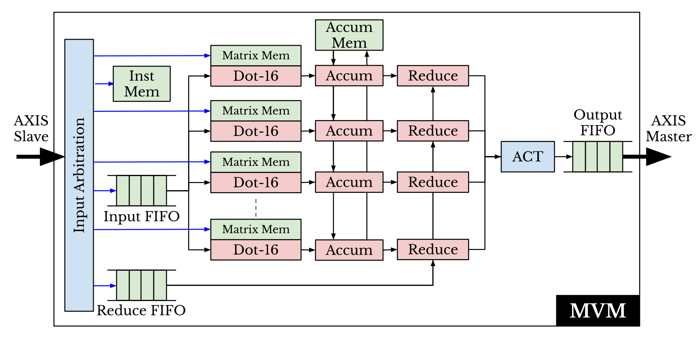
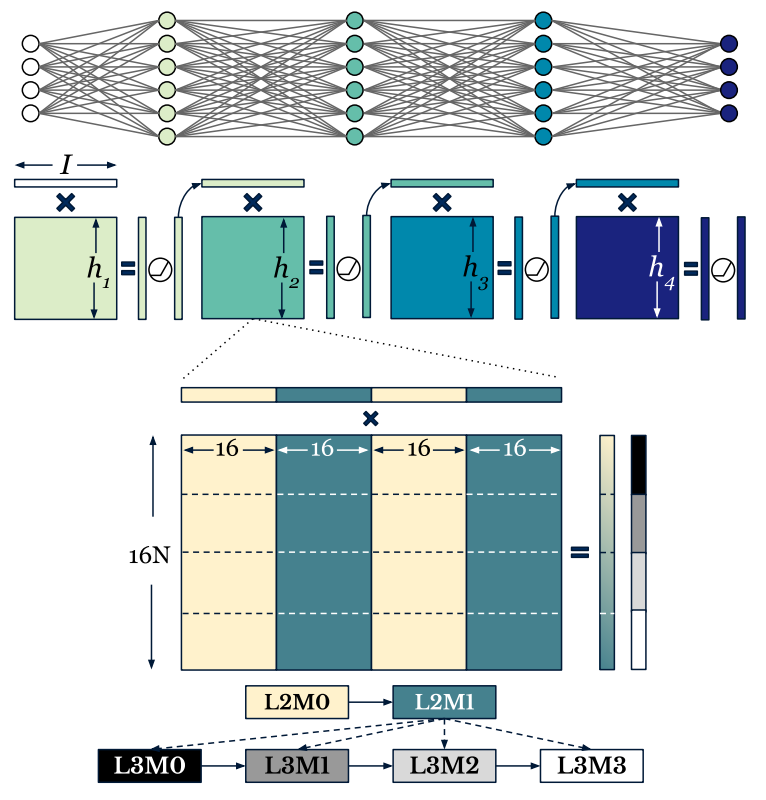
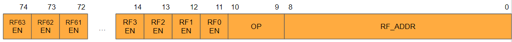
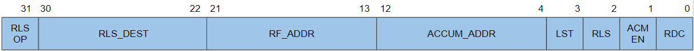

Example: MLP RTL Co-Simulation Design
======================================
In this example, a multi-layer perceptron is co-simulated with both SystemC and RTL verilated modules to demonstrate RTL support in RAD-Sim.

This guide serves as a complement to the source code provided in the ``rad-flow/rad-sim/example-designs/mlp_int8`` directory of the repo.

Design Architecture
-------------------
This design consists of five top-level modules: The Matrix Vector Multiplication (MVM), the Dispatcher, the Weight Loader,
the Instruction Loader, and the Collector module.
There is a compiler included to generate sample test cases that can be loaded into the design.
The MVM module is implemented in both SystemC and RTL to illustrate co-simulation compatibility in RAD-Sim.
All modules communicate via the AXI-S protocol.

All figures provided in this documentation and further information on the architecture can be found in the following paper:

`S. Srinivasan, A. Boutros, F. Mahmoudi and V. Betz, "Placement Optimization for NoC-Enhanced FPGAs," 2023 IEEE 31st Annual International Symposium on Field-Programmable Custom Computing Machines (FCCM), Marina Del Rey, CA, USA, 2023, pp. 41-51, doi: 10.1109/FCCM57271.2023.00014.`

Prerequisites
--------------
RAD-Sim co-simulation requires the installation steps in :doc:`../rad-sim-rtl-code` to be performed before following this example.

The source code for this example design can be found included in the RAD-Sim GitHub repository, under ``rad-flow/rad-sim/example-designs/mlp_int8``.

Components
----------

MVM
^^^^
The MVM module is responsible for performing matrix vector multiplication.
It uses a modular scalable design to perform MVM calculations in parallel.

The figure below describes the workflow for the MVM module.

A fixed number of parallel Dot-Product Engines (DPEs) are used to calculate up to L by D elements in each timestep,
where L is the number of lanes (number of elements each DPE can handle at once), and D is the number of DPEs in the MVM.
In the case the size of the vector exceeds L, subsequent elements in the vector are queued in a FIFO in sets of L and processed sequentially.
This design also supports multiple MVM modules to parallelize this process.
In the case the number of rows in the matrix is larger than D, subsequent rows are computed after the first D rows by the same MVM unit.

The accumulation process keeps track of the vector result each MVM produces per timestep and
adds to this vector result with each new input vector set in the FIFO.

The reduction process adds the result from one MVM unit to another, eventually producing a single vector.

In the figure below for layer 2, L is defined as 16 elements, and D is defined as 16 rows.
The matrix is of size 64x(16N), where N=4. There are 2 MVMs working in parallel on layer 2.

After each MVM has completed its own independent calculations and accumulated the results, L2M0 sends the results to L2M1 to be reduced.
These results are subsequently sent to the corresponding Layer 3 MVMs as input vectors.

Dispatcher
^^^^^^^^^^^
The dispatcher module is responsible for sending input vectors to the first layer MVMs.
Input Vectors are generated via the compiler and sent to the corresponding MVM via AXI-S.

Weight Loader
^^^^^^^^^^^^^^
Weights are stored in memory in each MVM module, and are only required to be loaded once.
Weight matrices are generated by the compiler. The weight matrix for each DPE in all MVMs is independent.
Each weight matrix is loaded sequentially via AXI-S.

Instruction Loader
^^^^^^^^^^^^^^^^^^^
Instructions for each MVM are loaded once and are infinitely looped automatically (does not require a jump).
Instructions are generated by the compiler for each MVM and sent to the corresponding MVM via AXI-S.

Collector
^^^^^^^^^^
The collector module is responsible for obtaining the final vector result from the last MVM, and sending the result back to the driver testbench.

AXI-S Data Format
------------------

rx_tid (32 bits)
^^^^^^^^^^^^^^^^^
Reserved for NoC AXI-S interface routing. Set to 0x0.

rx_tdest (4 bits)
^^^^^^^^^^^^^^^^^^
NoC Node ID to send data to.

rx_tdata (512 bits)
^^^^^^^^^^^^^^^^^^^^
The data sent to the destination.

rx_tuser (75 bits)
^^^^^^^^^^^^^^^^^^

**RF_EN_i (63 bits)**: Which RF to apply the data to

- Only used when rx_tid = 3 (writing weights to register files)

**OP (2 bits)**: Type of data being sent

- ===  =======================
  0x0  Push Instruction
  0x1  Push Reduction Vector
  0x2  Push Input Vector
  0x3  Write Weights
  ===  =======================

**RF_ADDR (9 bits)**: Weight RF Address to Write to

- Only used when rx_tid = 3 (writing weights to register files)

Instruction Format
-------------------
The instruction size is 32-bits.

**RLS_OP (1 bit)**: The type of vector released from the RLS command

- This field is only used when sending to an MVM and with the ``RLS`` field asserted 1.

- 0 for releasing reduction vector.

- 1 for releasing input vector.

- Unused if sending to the collector module.

**RLS_DEST (9 bits)**: The destination node ID to release to

- This field is only used with the ``RLS`` field asserted 1.

- NoC node ID of the destination MVM or collector module.

**RF_ADDR (9 bits)**: The register file address to read weights from

- Each DPE has its own RF to store the portion of the weight matrix relevant to it.

**ACCUM_ADDR (9 bits)**: The accumulator memory address to store to

- Each DPE has a separate accumulator memory to store the results it should accumulate between each vector in the FIFO queue.

**LST (1 bit)**: The LAST bit

- Assert 1 for the last chunk in each vector.

**RLS (1 bit)**: The RELEASE bit

- Assert 1 to output results to the output FIFO.

- Typically asserted in each chunk on the last vector in the MVM.

**ACM_EN (1 bit)**: The ACCUMULATE_ENABLE bit

- Assert 1 when accumulation should occur.

- Assert 0 when processing a new input (first vector of the input vector).

- The instructions processing vectors after the first vector should assert 1.

**RDC (1 bit)**: The REDUCE bit

- Assert 1 when reduction should take place in the chunk.

- Typically asserted on the last vector of an input vector, on the last MVM of a layer.

Running the Example
---------------------
To run the example, RAD-Sim must first be configured to run ``mlp_int8``.

.. code-block:: bash

    $ cd <rad_flow_root_dir>/rad-sim
    $ python config.py mlp_int8

Next, a test case is generated using the built-in Python compiler. Ensure the radflow conda environment is activated.
The specifications of the ``gen_testcase.py`` tool is:
``python gen_testcase.py <num_layers> <input_size> {<hidden_dims>} {<mvms_per_layer>}``.
In this example, a 4-layer MLP is generated with a 512 element input vector.

.. code-block:: bash

    $ conda activate radflow
    $ cd <rad_flow_root_dir>/rad-sim/example-designs/mlp/compiler
    $ python gen_testcase.py 4 512 512 512 256 128 3 3 2 2

Co-simulation parameters can be configured via the ``layer_mvm_config`` file, located in the same directory as the compiler script.
This file generated by the compiler can be changed to support the use of verilated MVM modules alongside/replacing native SystemC MVM modules.
The specifications of this file is: ``<num_layers> {<layer_sysc_mvms>,<layer_verilated_mvms>}``.

For example, to support 2 SystemC MVMs on layers 1 and 2, and 1 SystemC MVMs on layers 3 and 4 (and 1 Verilated MVM on layers 1, 2, 3, and 4),
layer_mvm_config is configured as:
``4 2,1 2,1 1,1 1,1``

Finally, the example can be run.

.. code-block:: bash

    $ cd <rad_flow_root_dir>/rad-sim/build
    $ make run