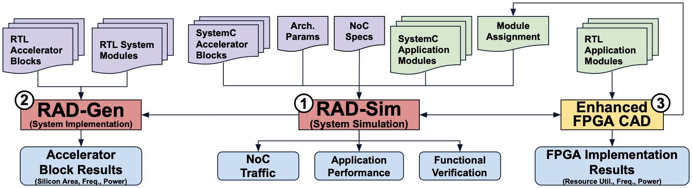

.. RAD Flow documentation master file, created by
   sphinx-quickstart on Tue Aug 15 16:35:52 2023.
   You can adapt this file completely to your liking, but it should at least
   contain the root `toctree` directive.

The RAD Flow
=============

Introduction
------------

The RAD flow is an open source academic architecture exploration and evaluation flow for novel beyond-FPGA 
reconfigurable acceleration devices (RADs). These devices incorporate conventional FPGA fabrics, several coarse-grained 
domain-specialized accelerator blocks, and high-performance packet-switched networks-on-chip (NoCs) for system-level 
communication. The flow consists of the following tools:

- **RAD-Sim:** A SystemC simulator for rapid design space exploration and architecture-application co-design

- **RAD-Gen:** A push button tool for silicon area/timing/power implementation results of hard (ASIC) RAD components, FPGA fabric circuitry, and different 3D considerations (Under development)

How to Cite
-----------

The following paper may be used as a general citation for RAD-Sim:

.. code-block:: bibtex

   @article{rad-sim,
      title={{Architecture and Application Co-Design for Beyond-FPGA Reconfigurable Acceleration Devices}},
      author={Boutros, Andrew and Nurvitadhi, Eriko and Betz, Vaughn},
      journal={IEEE Access},
      volume={10},
      pages={95067--95082},
      year={2022},
      publisher={IEEE}
   }

.. toctree::
   :caption: RAD-Sim Documentation
   :maxdepth: 3

   rad-sim-quick-start
   rad-sim-code-structure
   rad-sim-rtl-code
   examples/rad-sim-examples
   rad-sim-developer

.. toctree::
   :caption: RAD-Gen Documentation
   :maxdepth: 3

   rad-gen-about
   rad-gen-quick-start
   rad-gen-quickstart/index
   rad-gen-asic-dse/index
   rad-gen-coffe/index
   rad-gen-ic3d/index