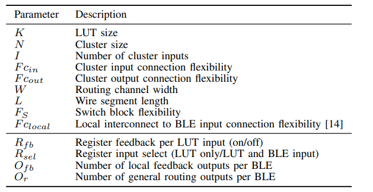
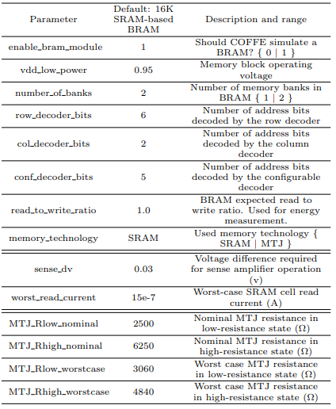
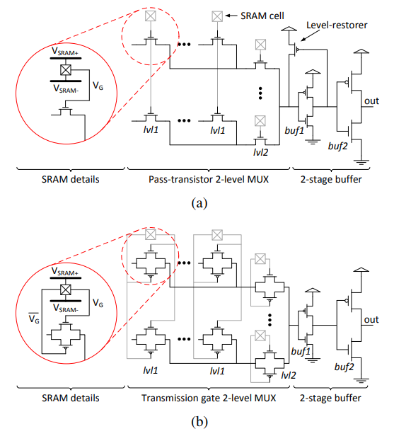
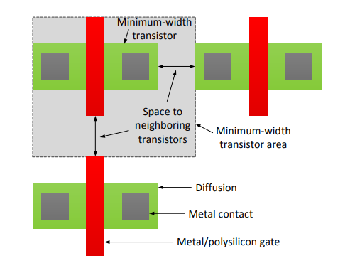
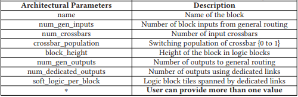

COFFE Overview
==========================================

################################################
COFFE Configuration File Parameter Descriptions
################################################

- All FPGA architecture related parameters are stored under the namespace “fpga_arch_params”
- The following section will describe each parameter in the input yaml file and one can look to the provided example file to determine the corresponding datatype for each param.

+++++++++++++++++++++++
Utility Parameters
+++++++++++++++++++++++

+--------------------+---------------------------------------------------------------------------------------------------------------------------------+
|     Parameter      |                                                           Description                                                           |
+====================+=================================================================================================================================+
|  arch_out_folder   | The directory in which output files will be stored. If not specified, the directory containing this file is used as output dir. |
+--------------------+---------------------------------------------------------------------------------------------------------------------------------+
| area_scale_factor  |                                           Standard cell to custom area scaling factor                                           |
+--------------------+---------------------------------------------------------------------------------------------------------------------------------+
| freq_scale_factor  |                                        Standard cell to custom frequency scaling factor                                         |
+--------------------+---------------------------------------------------------------------------------------------------------------------------------+
| power_scale_factor |                                          Standard cell to custom power scaling factor                                           |
+--------------------+---------------------------------------------------------------------------------------------------------------------------------+

The above scaling factors can be useful when one doesn't have access to a modern standard cell library but does have access to a more modern spice deck (or vice versa)

++++++++++++++++++++++++++++++++++++
FPGA Architecture Parameters
++++++++++++++++++++++++++++++++++++

++++++++++++++++++++++++++++++++++++
Memory Block Parameters
++++++++++++++++++++++++++++++++++++

Memory block parameters are used if one wants to model the FPGA BRAM.

++++++++++++++++++++++++++++++++++++++++++++++++++++++
Additional Tx Sizing (Custom Circuit Flow) Parameters
++++++++++++++++++++++++++++++++++++++++++++++++++++++

+---------------------+-------------------------------------------------------------------------------------------------------------------------------------------------+
|      Parameter      |                                                                   Description                                                                   |
+=====================+=================================================================================================================================================+
|   transistor_type   |                                                      Can use “bulk” or “finfet” transistor                                                      |
+---------------------+-------------------------------------------------------------------------------------------------------------------------------------------------+
|     switch_type     |                                 Uses either “pass_transistor” or “transmission gate” in FPGA MUX/LUT circuitry.                                 |
+---------------------+-------------------------------------------------------------------------------------------------------------------------------------------------+
|         vdd         |                                                               FPGA supply voltage                                                               |
+---------------------+-------------------------------------------------------------------------------------------------------------------------------------------------+
|        vsram        |                       Voltage of FPGA configuration SRAM cells (Importantly also the boost voltage for pass transistors)                        |
+---------------------+-------------------------------------------------------------------------------------------------------------------------------------------------+
|       vsram_n       |                                                                 SRAM cells VSS                                                                  |
+---------------------+-------------------------------------------------------------------------------------------------------------------------------------------------+
|     gate_length     |                                                 Gate length (in nm) of minimum size transistor                                                  |
+---------------------+-------------------------------------------------------------------------------------------------------------------------------------------------+
| rest_length_factor  | Factor which determines gate length of the level-restorer transistor in Figure 1a. length will be equal to “rest_length_factor” x “gate_length” |
+---------------------+-------------------------------------------------------------------------------------------------------------------------------------------------+
|   min_tran_width    |                                                     Minimum transistor diffusion width (nm)                                                     |
+---------------------+-------------------------------------------------------------------------------------------------------------------------------------------------+
| min_width_tran_area |                                                      Minimum-width transistor area (nm^2)                                                       |
+---------------------+-------------------------------------------------------------------------------------------------------------------------------------------------+
|   sram_cell_area    |                                          Area of a single SRAM cell in number of “min_width_tran_area”                                          |
+---------------------+-------------------------------------------------------------------------------------------------------------------------------------------------+
|     model_path      |                                                        Path to SPICE device model files                                                         |
+---------------------+-------------------------------------------------------------------------------------------------------------------------------------------------+
|    model_library    |                                                          Library in model file to use                                                           |
+---------------------+-------------------------------------------------------------------------------------------------------------------------------------------------+
|        metal        |                     List of metal layer RC values to use, the following rows in this table represent different metal layers                     |
+---------------------+-------------------------------------------------------------------------------------------------------------------------------------------------+
|      metal[0]       |                                    All wires except the general routing wires are implemented in this layer.                                    |
+---------------------+-------------------------------------------------------------------------------------------------------------------------------------------------+
|      metal[1]       |                                             General routing wires will be implemented in this layer                                             |
+---------------------+-------------------------------------------------------------------------------------------------------------------------------------------------+
|      metal[2]       |                                              Memory array wires will be implemented in this layer                                               |
+---------------------+-------------------------------------------------------------------------------------------------------------------------------------------------+
|      metal[3]       |                                         This layer is used in MTJ wordline (if BRAM technology is MTJ)                                          |
+---------------------+-------------------------------------------------------------------------------------------------------------------------------------------------+

The below figures may help with understanding some of the above parameters and how they relate to the FPGA architecture.

+++++++++++++++++++++
Hardblock Parameters
+++++++++++++++++++++

