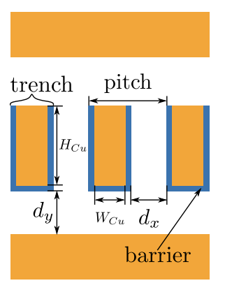
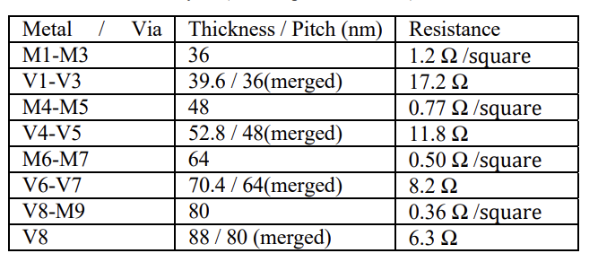

IC-3D Overview
----------------------------------------------------

To evaluate circuit level characteristics of multi-die devices one has to provide detailed information about the process being used.
This includes metal/via RC values, spice transistor models, transistor geometry information, and more. 

It can sometimes be difficult to know where to start when trying to find this information. 

The first step is to find the following information related to the metal layers of the PDK you would like to use.

- Metal/Via Pitches
- Metal Aspect Ratios
- Metal Barrier Thickness
- Dialectric relative permittivity (eps)

The below figure may help to understand the interconnect cross section.

    
    Interconnect Cross Section [2]

We will use ASAP7 [1] as an example.

    
    ASAP7 BEOL Layers (metal aspect ratio 2:1)  [3]

The above figure from [1], shows metal/via pitches. 

Elsewhere in [3] we can find the the barrier thickness is 1.5 nm and the relative permittivity is 3.9 F/m.

From this information we can use EPFL's `github repo <https://github.com/EPFL-LAP/fpga21-scaled-tech>`_ [2] to generate the RC values based on the above inputs.

RC Value Generation
---------------------

RAD-Gen will soon integrate the below tool rather than using it manually, but if required follow steps below.

.. code-block:: bash

    $ git clone git@github.com:EPFL-LAP/fpga21-scaled-tech.git
    $ cd fpga21-scaled-tech/rc_calculations

You will need to edit the inputs.py file and replace the existings barrier, pitches, aspect ratios, and eps values with the values from the PDK you are using.

.. code-block:: bash

    $ # Running this generates the metal RC values (resistance per um, capacitance per um)
    $ python3 generate_table_2.py 
    $ # Running this generates the via resistance values (resistance of a single via)
    $ python3 generate_table_3.py
    $ # Running this generates resistance of connected via totems through multiple metal layers
    $ python3 generate_table_4.py

Bibliography
-----------------------------

`[1]: ASAP7: A 7-nm finFET predictive process design kit <https://www.sciencedirect.com/science/article/pii/S002626921630026X>`_
`[2]: Global Is the New Local: FPGA Architecture at 5nm and Beyond <https://dl.acm.org/doi/pdf/10.1145/3431920.3439300>`_
`[3]: Design Flows and Collateral for the ASAP7 7nm FinFET Predictive Process Design Kit <https://ieeexplore.ieee.org/stamp/stamp.jsp?tp=&arnumber=7945071&tag=1>`_