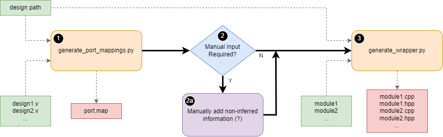

Compiling a RAD-Sim Module with RTL
====================================
RAD-Sim has the capability to support RTL code (Verilog/SystemVerilog only) through Verilator.
Verilator compiles RTL code into a faster optimized model, wrapped inside a C++/SystemC module.
More information about Verilator can be found at `Veripool <https://veripool.org/guide/latest/index.html>`_.
A performance test repo can be found at `GitHub https://github.com/geotrieu/mvm_perf_test`.

Installation
-------------
#. Prerequisites:

   * Follow installation instructions found at :doc:`rad-sim-quick-start`.

#. Install Verilator through Git

   * Instructions `here <https://verilator.org/guide/latest/install.html#git-quick-install>`_.
   * It is important to install Verilator through Git, and not through a package manager.

#. Set Environment Variables

   * For bash users, ``~/.bashrc``, for zsh users, ``~/.zshrc``.
   * The values of these variables highly depend on where each library is installed, adjust accordingly
   * ``export SYSTEMC_INCLUDE="/opt/systemc/include"``
   * ``export SYSTEMC_LIBDIR="/opt/systemc/lib"``
   * ``export SYSTEMC_HOME="/opt/systemc"``
   * ``export LD_LIBRARY_PATH=${SYSTEMC_HOME}/lib``
   * ``export VERILATOR_ROOT="/usr/local/verilator"``

Setting Up a Project with RTL
-----------------------------
RAD-Sim has a pre-defined file structure for supporting RTL code. All RTL code must be stored in an ``rtl`` folder under the ``modules`` folder.

.. code-block::

    rtl_add
    ├── modules
    │   ├── rtl
    │   │   ├── adder.v
    │   │   ├── client.v
    │   │   ├── fifo.v
    │   │   ├── static_params.vh
    │   │   ├── port.map
    │   │   └── CMakeLists.txt
    │   ├── adder.cpp
    │   ├── adder.hpp
    │   ├── client.cpp
    │   └── client.hpp
    ├── rtl_add_driver.cpp
    ├── rtl_add_driver.hpp
    ├── rtl_add_system.cpp
    ├── rtl_add_system.hpp
    ├── rtl_add_top.cpp
    ├── rtl_add_top.hpp
    ├── rtl_add.clks
    ├── rtl_add.place
    ├── CMakeLists.txt
    └── config.yml

An example design that utilizes RTL modules can be found in the ``rad-sim/example-designs/rtl_add`` folder.

.. note::
   For designs containing multiple RADs,  RAD-Sim adds a portal module to each RAD for communication between devices.
   Bitwidths for AXI-S signals carrying destination address (``tdest``) should match the ``DESTW`` set in 
   ``sim/radsim_defines.hpp``, which is generated by running:
      .. code-block:: bash
      $ python config.py <design_name>

.. note::
   RAD-Sim adds a portal module for designs containing multiple RADs. The NoC, clock, and general configuration files
   should be modified according to the developer guide.

RTL CMakeLists
---------------
The RTL source folder additionally contains a CMakeLists script, and an optional port mapping file used for :ref:`automatic wrapper generation <auto_wrapper_gen>`.
The CMakeLists script imports the required libraries and verilates the RTL designs to SystemC modules.
These objects are linked in the design CMakeLists script.

Under ``rtl_top_modules``, a list of all top-level RTL modules should be placed. Each top-level module will be verilated to become a C++ SystemC module.
All modules instantiated by a top-level module are merged into the SystemC module of the top-level design automatically.

Verilator does not recognize modules with a file name other than the module name with a .v/.sv extension automatically.
It is therefore recommended that a list of non top-level modules be added under ``rtl_libraries``.

A sample CMakeLists file can be found in the ``rad-sim/example-designs/rtl_add/modules/rtl`` folder.

Wrapper Files
-------------
Wrapper files are required to connect the SystemC modules to RAD-Sim.
RAD-Sim modules are inherited from SystemC modules.

Wrapper files connect SystemC modules to RAD-Sim by instantiating the SystemC module, passing the inputs and outputs to the higher-level modules, and registering the module to the NoC.

.. _auto_wrapper_gen:

Automatic Wrapper Files Generation
-----------------------------------
RAD-Sim includes scripts to generate basic wrapper files in the ``rad-sim/scripts`` directory.
Automatic wrapper generation follows the workflow:

#. Run ``generate_port_mappings.py`` with the design path and RTL design files as arguments.
   
   * ex. ``python generate_port_mappings.py example-designs/rtl_add adder.v client.v``

#. Check the console for inference warnings.
   
   a. If there are warnings about information unable to be determined automatically, manual changes to any "?" marks in the ``port.map`` file must be made.
      The ``port.map`` file can be found in the ``design_path/modules/rtl`` folder.

#. Run ``generate_wrapper.py`` with the design path and module names as arguments.

   * ex. ``python generate_wrapper.py example-designs/rtl_add adder client``
   * Note: these are modules connected to the NoC.

These scripts produce basic source and header wrapper files for the specified RTL modules.
Advanced users may edit these files to add additional functionality.

AXI-S/AXI-MM Formatting Requirement
^^^^^^^^^^^^^^^^^^^^^^^^^^^^
Ports in RTL modules using AXI-S/AXI-MM must be specified in the format ``axis_{name}_{signal}`` or ``aximm_{name}_{signal}`` to be recognized by the port mappings script.

Port Map File Format
^^^^^^^^^^^^^^^^^^^^^
The port map file is a blank-space delimited file used to specify the connection between the Verilator-generated SystemC module to the wrapper RAD-Sim module.

* All inputs, outputs, and AXI-S ports must be under a ``module``.
* Modules are defined by ``module {name}``.
* Input and Output ports are defined by ``{input/output} {port_width} {rtl_port} {radsim_port}``.
* AXI-S ports are defined by ``axis {master/slave} {rtl_port} {axis_interface} {axis_port}``.
* AXI-MM ports are defined by ``aximm {master/slave} {rtl_port} {aximm_interface} {aximm_port}``.

An example port map file from the ``rtl_add`` example is shown below:

.. code-block::

   module adder
   input 1 clk clk
   input 1 rst rst
   axis slave axis_adder_tvalid axis_adder tvalid
   axis slave axis_adder_tlast axis_adder tlast
   axis slave axis_adder_tdata axis_adder tdata
   axis slave axis_adder_tready axis_adder tready
   output 128 response response
   output 1 response_valid response_valid

   module client
   input 1 clk clk
   input 1 rst rst
   input 128 client_tdata client_tdata
   input 1 client_tlast client_tlast
   input 1 client_valid client_valid
   axis master axis_client_tready axis_client tready
   output 1 client_ready client_ready
   axis master axis_client_tvalid axis_client tvalid
   axis master axis_client_tlast axis_client tlast
   axis master axis_client_tdest axis_client tdest
   axis master axis_client_tid axis_client tid
   axis master axis_client_tstrb axis_client tstrb
   axis master axis_client_tkeep axis_client tkeep
   axis master axis_client_tuser axis_client tuser
   axis master axis_client_tdata axis_client tdata
